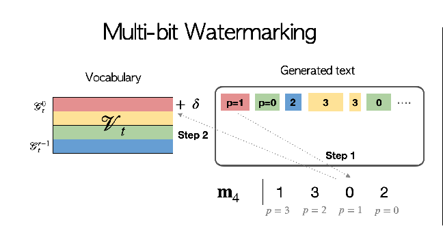

## 嵌入水印

将整个单词表划分成 r 份。

我们的目标是将一段水印信息嵌入到生成的文本中。将这段水印信息编码为长度为 b，每位取值为 $\{0,...,r-1\}$ 的串。记这个编码串为 m。

生成一个 token 时，随机取 $\{0,...,b-1\}$ 中的一个数 p。倾向于从 $m[p]$ 单词表中选 token。

## 检测水印

m 中不同位置有不同数字，代表不同词汇表子集。数字出现的频率分布和词汇的分布正相关。假如 m 中很多位置的值都是 3，那么最后生成的文本中很多 token 都来自于第 3 个词汇表子集。可以通过检测词频来判断是否存在水印。

为 m 中每个位置 i 维护 r 个计数器 $\{W_i[0],...,W_i[r-1]\}$。如果一个 token 对应 m 中的位置 i，且位于 j 词汇表时，$W_i[j]$ 加 1。如果该文本中有水印，那么使得 $W_i$ 最大的词汇表 j 应该为 $m[i]$ 词汇表。

根据假设检验的知识，设零假设为无水印，备择假设为有水印。零假设下每个位置计数器的分布应该为一个0 到 r-1 的多项分布，每个值的概率均为 $\gamma$。如果能够发现明显的偏差，就能推翻零假设。

## 如何为每个 token 分配 `位置 p`（对应论文 Position Allocating 部分）

一个 Bad idea 是轮转分配。缺点是很容易被攻击破坏水印。

论文中采取的方法是 hash。先通过伪随机函数（相当于 hash function）根据窗口内的文本生成一个 hash value。然后再将这个 hash value 作为随机数产生器用于产生位置 p。

## List Decoding

解码的结果可能有错。为了减少错误的影响，可以让解码算法不仅仅返回一个结果，而是返回一系列相近的结果。

## 讨论

内容承载量和检测效果之间存在 trade-off。

r 越大，意味着嵌入信息的长度越短，但是也意味着每个位置的可能指示的值。

List Decoding 是有效的。置信度和错误率是负相关的，越高的置信度代表越低的错误率。和随机输出相比，List Decoding 是有效的。