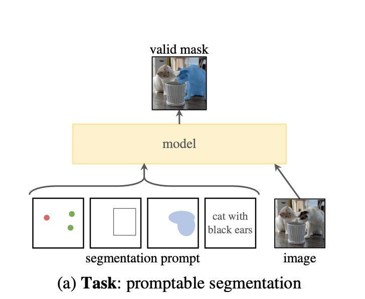
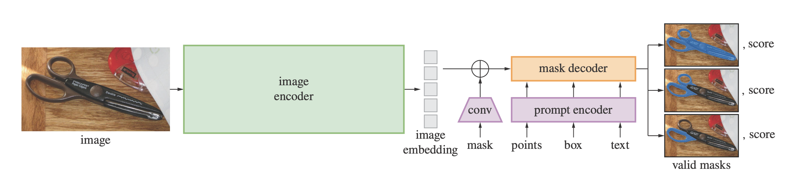

本文是对 Meta SAM 论文的一篇随笔，主要记录了文章带来的启发。

## 概览

这篇工作的主题是图像分割。主要贡献有：

- 提出任务 promptable segmentation task：在有提示的情况下进行图像分割。
- 模型 SAM：能够根据提示快速生成掩码。
- 数据引擎：可以自动生成掩码数据用于训练模型。
- 数据集 SA-1B：1B 大小的掩码数据集。

## 任务*

新任务是本文的亮点之一。本文提出了一个新任务：在有提示的情况下进行图像分割。提示的灵感来自于 NLP 领域。

本文使用的提示包括前景点（如鼠标点击）、粗略的框、文本。如下图所示

## 模型

本文的模型比较简单，基本是由之前的模型改造+组装得到的。

模型大致结构如图

## 数据引擎*

数据引擎实际上就是通过原始图像生成掩码数据的一套流程。数据引擎也是本文的一大亮点，具体有以下几个开创性成就：

- 本文一共生成了 1B 的掩码数据。这大概是 COCO 的一万倍。
- 这么多数据其中有九成是完全自动生成的，剩下的部分也有计算机辅助。这极大减少了人工数据标注的工作量。
- 数据引擎不局限于某个特定的数据集，可以应用于任意的图片。

## 零样本迁移

文章在这一块做了很多论述，但是因为主要在说明效果而不是原理，所以我没有细看。

## 启发

这篇帖子从 data-centric AI 的角度解读了 SAM 的意义。我觉得很有启发性。

https://www.zhihu.com/question/593888697/answer/2972047807

总的来说有以下几点启发：
- 数据是目前 AI 研究的瓶颈和重心之一。我们需要更好、更多、更快的数据。
- 我们应该有一种系统化的方法获取和处理数据，比如本文的数据引擎。

## 需要学习的地方

- ViT
- CLIP
- 零样本迁移