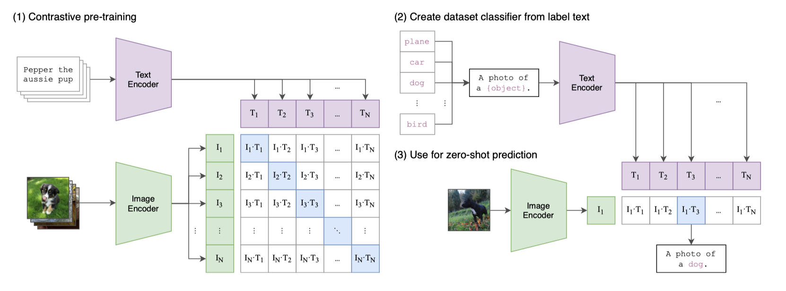

这是一篇关于 CLIP 模型的随笔。

## 概览

CLIP 模型的主题是图像分类。

## 思路

基于配对的文本和图片进行对比学习，训练文本编码器和图片编码器。

将任意分类标准（如 ImageNet 的 1k 个类别）转换为文本再输入进文本编码器，将图片输入图片编码器，找到最接近的类别编码。

整体思路如下图所示

## 启发

### 原始文字代替固定标签

CLIP 的强大之处在于可以直接联系原始文字和图片，摆脱了固定标签的限制。过去的 CIFAR, ImageNet 等都给图片固定了标签。而 CLIP 可以直接关联自然语言文本和图片。

### 规模带来质变

其实在 2020 年就有很多类似 CLIP 的工作，但是它们的数据集、参数量远不如 CLIP（CLIP 用了 400M 的数据和 Vit-Large），因此效果也比不上 CLIP。这个现象体现了 Scale Law。

作者还发现，迁移学习（Zero-shot）的能力基本和模型大小成正相关。
