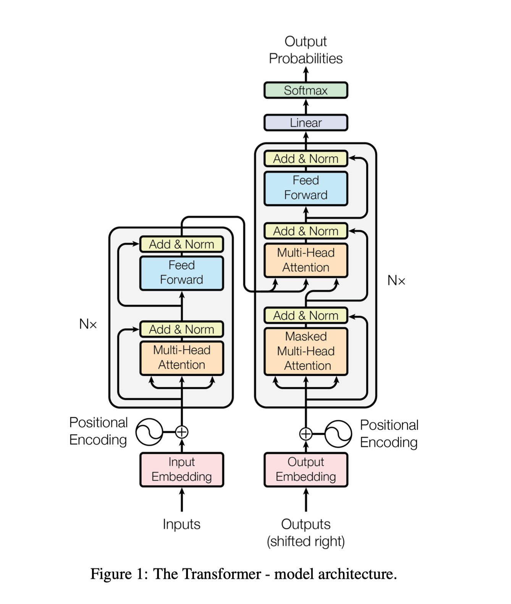

本文是对 Attention is All You Need 这篇论文的一篇随笔，简单记录了对 Transformer 架构中概念的理解。

## Attention 函数

Q 形状 (n, dk)，K 形状 (m, dk)，V 形状 (m, dv)。以机器翻译为例，n 的含义是目标语句的长度，m 的含义是源语句的长度。

Attention 函数将 Q, K, V 映射成一个形状为 (n, dv) 的矩阵，代表目标语句的向量序列，其长度为目标语句长度，向量值为 V 每个向量加权和。

## Transformer 架构

在编码器和解码器的第一个注意力层，输入同时作为 Q, K, V，这种机制被称为自注意力机制。

假设输入的序列长度为 n，向量维度为 d。输出序列长度为 m。

对于编码器的注意力层，由于自注意力机制，输入和输出长度和向量维度是一样的。因此输出实际上是输入的加权和，并且同一个位置的权重最大，如果输入序列中有其他向量和该位置的向量类似，则也会有较大的权重。

对于解码器的第一个注意力层，同样由于自注意力机制，输出也是输入的加权和。但需要注意这里加了掩码，所以当前时刻后面的权重全部为 0。

对于解码器的第二个注意力层，其 K, V 来自于编码器，其 Q 来自于解码器的上一个注意力层。